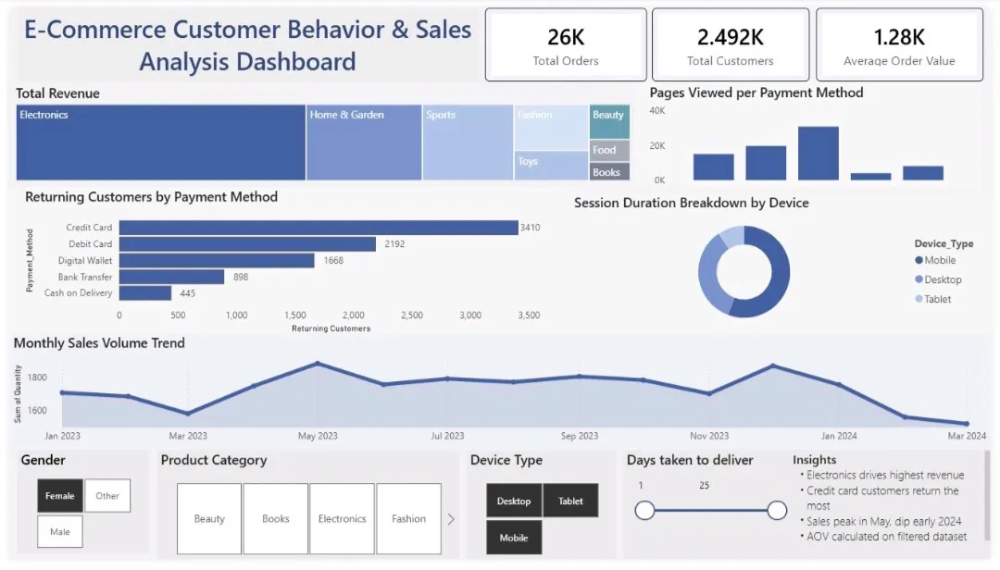

# 🛒 E-Commerce Customer Behavior & Sales Analysis Dashboard


---

## 📌 Project Overview

This project presents an interactive Power BI dashboard developed to analyze e-commerce customer behavior, purchasing patterns, customer retention, and sales performance.

The dashboard enables business users to monitor key performance indicators, identify revenue-driving product categories, evaluate customer engagement across devices, and uncover actionable insights through interactive visualizations and dynamic filtering.

---

## 🎯 Business Objectives

- Analyze revenue distribution across product categories
- Understand customer retention and loyalty patterns
- Evaluate payment method preferences
- Analyze customer engagement across device types
- Monitor monthly sales performance trends
- Support data-driven decision-making through interactive reporting

---

## 📊 Dashboard Features

### Revenue Analytics
- Revenue by Product Category
- Category-wise Sales Contribution
- Revenue Distribution Analysis

### Customer Analytics
- Returning Customers by Payment Method
- Customer Retention Analysis
- Payment Preference Evaluation

### User Engagement Analytics
- Session Duration by Device Type
- Device Usage Analysis
- Customer Browsing Behavior

### Sales Analytics
- Monthly Sales Volume Trend
- Time-Series Sales Analysis
- Seasonal Performance Monitoring

### Interactive Filtering
Users can dynamically filter the dashboard using:

- Gender
- Product Category
- Device Type
- Delivery Time

---

## 📈 Key Insights

- Electronics generated the highest share of total revenue.
- Credit Card users represented the largest segment of returning customers.
- Mobile devices recorded the highest average session duration.
- Sales activity peaked during the middle of the year and declined in early 2024.
- Customer engagement varied significantly across payment methods and device types.

---

## 🛠️ Technology Stack

| Technology | Purpose |
|------------|----------|
| Power BI Desktop | Dashboard Development |
| DAX | KPI & Measure Calculations |
| Power Query | Data Transformation |
| Data Modeling | Relationship Management |
| Interactive Visualizations | Business Reporting |

---

## 📂 Repository Structure

```text
dashboard/
└── E-Commerce Customer Behavior & Sales Analysis dashboard.pbix

images/
└── dashboard-preview.png

README.md
LICENSE
```

---

## 📷 Dashboard Preview



---

## 📊 Dataset

**Source:** Kaggle

The dataset contains information related to:

- Customer Demographics
- Product Categories
- Payment Methods
- Device Types
- Session Duration
- Revenue Metrics
- Sales Transactions

---

## 🚀 How to Use

1. Clone the repository

```bash
git clone https://github.com/SHREYA-79/e-commerce-customer-behavior-sales-analysis.git
```

2. Open the `.pbix` file using Power BI Desktop

3. Interact with slicers and visuals to explore business insights

---

## 💡 Skills Demonstrated

- Business Intelligence Reporting
- Dashboard Design
- Data Visualization
- KPI Development
- DAX Calculations
- Customer Analytics
- Sales Performance Analysis
- Interactive Reporting
- Data Modeling

---

## 👩‍💻 Author

### Shreya Reddy

Built using Power BI, DAX, Power Query, Data Modeling, and Business Intelligence techniques.
